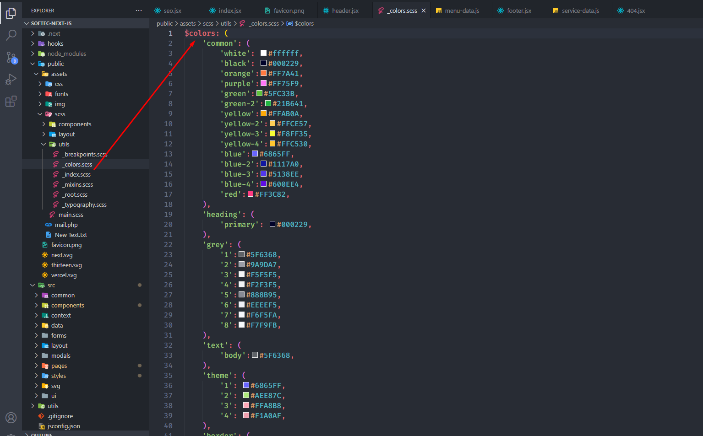

          Softec - Data analytics React Next js Template Documentation          

[request support](https://help.themepure.net) [Visit Themes](https://themeforest.net/user/theme_pure/portfolio)

### Doc Navigation

*    [ Getting Started](#getting_started)
    *   [Introduction](#introduction)
    *   [What's Included](#what_included)
*    [ React Installation](#react_installation)
*    [ Basic Site Setting](#basic_site_setting)
    *   [Change Site Title and Favicon](#change_site_title_and_favicon)
    *   [Changing Brand Logo](#change_logo)
    *   [Customize Menu](#customize_menu)
    *   [Customize Footer](#customize_footer)
*    [ Pages](#pages)
    *   [Blog](#blog)
    *   [Service](#product)
    *   [404](#404)
*    [ Template Options](#template_options)
    *   [Header](#option_header)
    *   [Color](#option_color)
    *   [Typography](#option_typo)
*   [Support](#support)

1.  **Item Name :** Softec - Data analytics React Next js Template
2.  **Created:** 05 April 2023
3.  **Item Version :** v 1.0.0
4.  **Author :** [theme\_pure](https://themeforest.net/user/theme_pure/portfolio)
5.  **Support Ticket:** [https://help.themepure.net](https://help.themepure.net)

Introduction
------------

#### Softec - Data analytics React Next js Template

For any support please don't hesitate to contact us at [**Support Center**](https://help.themepure.net). We provide 13 hours real-time support for our customers.

We would like to thank you for choosing **Softec**.

### Getting started

Softec - Data analytics React Next js Template is a modern Responsive Multi-Purpose Multi-Page bootstrap template for startup digital agencies and SEO agencies that offers design, development, and online marketing services to its client.

Requirements
------------

There are system requirements in order to install and setup Softec template and its components properly. Make sure that you are installed **node.js** and **Yarn**.

#### For nodejs go here [Nodjs](https://nodejs.org/en/)

#### For yarn go here [Yarn](https://classic.yarnpkg.com/lang/en/docs/install/#windows-stable)

#### Install Yarn

#### Template Features

*   React JS
*   Next JS
*   Based on Bootstrap 5.x
*   ReactJS without jQuery
*   Free Premium Quality Support
*   Logo Slider Integration
*   Sticky Header
*   Google Fonts
*   100% Responsive
*   Nice and Clean Design
*   Clean and commented code
*   Customizeable all components of each page
*   Integrated with FontAwesome
*   5 Home Pages
*   24+ Inner Pages
*   Blog Pages
*   Image background
*   Easy to customize
*   Flexible and multi-purpose
*   Valid / CSS3
*   24/7 Awesome support
*   Detailed documentation

### What's Included

After purchasing Softec template on themeforest.net with your Envato account, go to your Download page. You can choose to download Softec template package which contains the following files:

#### The contents of the template package downloaded from ThemeForest

*   **Softec** - An React Next js Template file. this file you can edit and use for your business.
*   **Documentation** - This folder contains what you are reading now :)

React Installation
------------------

Please follow the instructions in the video to see how you can install react on your hosting:

1.  **For local host** -
    1.  Open you command prompt
    2.  npm install or npm install --legacy-peer-deps
    3.  npm run dev (will start the dev server at **http://loaclhost:3000**)

  
  

1.  **For locally build** -
    1.  Open you command prompt
    2.  Open package.json file and edit scripts > build replace this "build": "next build && next export",
    3.  yarn build (will build locally and generate out folder in root directory)
    4.  yarn start (will start the locally build server at **http://loaclhost:3000**)
2.  **Deploying to Vercel** - [https://www.youtube.com/watch?v=\_8wkKL0LKks](https://www.youtube.com/watch?v=KmxAH7ng8Qw&ab_channel=Codevolution)

  
  

##### Other Scripts

1.  Open you command prompt
2.  yarn lint:fix (This will format your code and fix auto fixable eslint error)

Basic Site Settings
-------------------

### Change Site Title, Favicon and Page Title

To change your Site title and Favicon open the Softec in your editor and go to the location by following screenshot which are given bellow.

You can change **title** here

You can change **page title** here

You can change **favicon** here

### Change Logo

To change logo and customize other header data do the following:

You can change **logo** here

### Customize Menu

To customize menu do the following:

1.  From the project folder go to layout header menus-dataOpen the menu you want to use
2.  Then customize the menu

Customize the menu

### Customize Footer

To customize footer data do the following:

1.  From the project folder go to layout footers footerOpen the menu you want to use
2.  Then customize the footer data

Customize the footer

### Customize Blog data

To customize blog data do the following:

1.  From the project folder go to data our blog data Open the menu you want to use
2.  Then customize the blog data

Customize the blog

### Customize Service data

To customize Service data do the following:

1.  From the project folder go to data service Open the menu you want to use
2.  Then customize the service data

Customize the products

### 404

To change 404 and setting you can change by following this screenshot here.

1.  From the project folder go to pages 404 Open the menu you want to use
2.  Then customize the 404 data

Customize the 404

### Customize Header

We gave you four header layout. you can modify the header markup there.

1.  From the project folder go to layout headersheader Open the menu you want to use
2.  Then customize the blog data

Customize the header

### Colors

To change color and setting you can change by following this screenshot here.

1.  From the project folder go to public assetsscssutils Open the menu you want to use
2.  Then customize the color data

Customize the color

### Typography

To change Typography and setting you can change by following this screenshot here.

1.  From the project folder go to public assetsscssutils Open the menu you want to use
2.  Then customize the Typography data

Customize the Typography

### Support

If you face any issue please contact us at [Support Ticket](https://help.themepure.net). We provide 15 hours real-time support for our customers.

Thank you for purchasing our template.

© 2023 All Rights Reserved by [theme\_pure](https://themeforest.net/user/theme_pure/portfolio).

